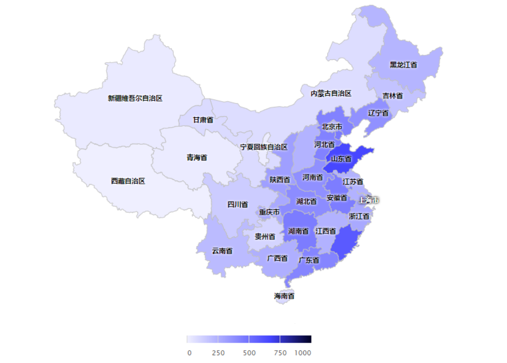

# 基于电商网站的大数据分析平台

## 实训简介

本项目就是从真实的电商数据分析平台项目抽取出来的离线数据分析部分，贯穿了Hadoop生态圈中的主要技术框架，并联合使用。主要是综合个人所学的大数据技术框架以达到熟练运用Hadoop为目的，进一步巩固所学的知识，并掌握企业中大数据开发整体流程，增加个人大数据开发项目经验。通过真实的企业大数据分析项目，提高项目架构、实战开发能力，做到立即上手开发大数据项目。

## 实训作者

* 自兴教研中心:刘星宝博士
* 自兴人工智能学院:王国瞻讲师
* 自兴校企合作事业部:欧朝

## 实训需要的开发环境

* CentOS 7
* Hadoop
* Nginx
* Flume
* Zookeeper
* HBase
* MySQL
* Hive
* Sqoop

## 实训步骤

1. 背景调研
2. 需求分析
3. 技术方案设计
4. 基础环境配置
5. 数据采集
6. 数据清洗
7. 数据分析
8. 数据可视化
