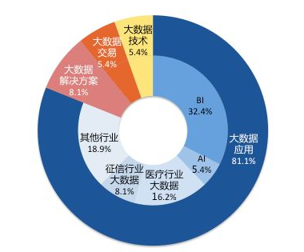

## 2.1背景调研

半个世纪以来，随着计算机技术全面融入社会生活，信息爆炸已经积累到了一个开始引发变革的程度。它不仅使世界充斥着比以往更多的信息，而且其增长速度也在加快。信息爆炸的学科如天文学和基因学，创造出了“大数据”这个概念。如今，这个概念几乎应用到了所有人类智力与发展的领域中。这是一个信息爆炸的时代。

正如马云所诉的我们正处于一个大数据的时代，我们需要了解到价值含量、挖掘成本比数量更为重要对于很多行业而言，如何利用这些大规模数据是赢得竞争的关键。

在运用大数据的经典案例中我们可以看到：全球零售业巨头沃尔玛在对消费者购物行为分析时发现，男性顾客在购买婴儿尿片时，常常会顺便搭配几瓶啤酒来犒劳自己，于是尝试推出了将啤酒和尿布摆在一起的促销手段。没想到这个举措居然使尿布和啤酒的销量都大幅增加了。如今，“啤酒+尿布”的数据分析成果早已成了大数据技术应用的经典案例，被人津津乐道。

经过数十年的积累，很多企业都聚集了大量的数据。这些数据也是企业的核心财富之一，怎样从累积的数据里寻找价值，变废为宝炼数成金成为当务之急。

但数据增长的速度往往比CPU和内存性能增长的速度还要快得多。要处理海量数据，如果求助于昂贵的专用主机甚至超级计算机，成本无疑很高，有时即使是保存数据，也需要面对高成本的问题，因为具有海量数据容量的存储设备，价格往往也是天文数字。成本和IT能力成为了海量数据分析的主要瓶颈。

Hadoop这个开源产品的出现，打破了对数据力量的压制。Hadoop源于Nutch这个小型的搜索引擎项目。而Nutch则出自于著名的开源搜索引擎解决方案Lucene，而Lucene则来源于对Google的学习模仿。在Hadoop身上有着明显的Google的影子。HDFS是GFS的山寨版，Map-Reduce的思想来源于Goolge对Page
rank的计算方法，HBase模仿的是Big
Table，Zookeeper则学习了Chubby。Google巨人的力量尽管由于商业的原因被层层封锁，但在Hadoop身上得到了完美的重生和发展。

