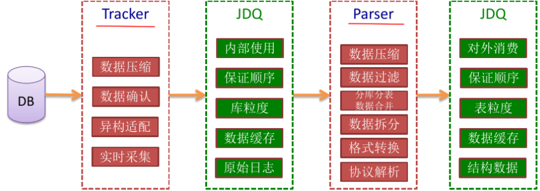

## 1.2项目简介

本项目就是从真实的电商数据分析平台项目抽取出来的离线数据分析部分，贯穿了Hadoop生态圈中的主要技术框架，并联合使用。主要是综合个人所学的大数据技术框架以达到熟练运用Hadoop为目的，进一步巩固所学的知识，并掌握企业中大数据开发整体流程，增加个人大数据开发项目经验。通过真实的企业大数据分析项目，提高项目架构、实战开发能力，做到立即上手开发大数据项目。

本项目主要适用于海量数据、离线数据和负责数据，主要应用场景如下：

场景1：数据分析，借助于大数据技术，分析客户行为，进行商品推荐和针对性广告投放。如电商海量日志分析，电商商品推荐，电商用户行为分析

场景2：离线计算，（异构计算+分布式计算）百度离线计算平台

