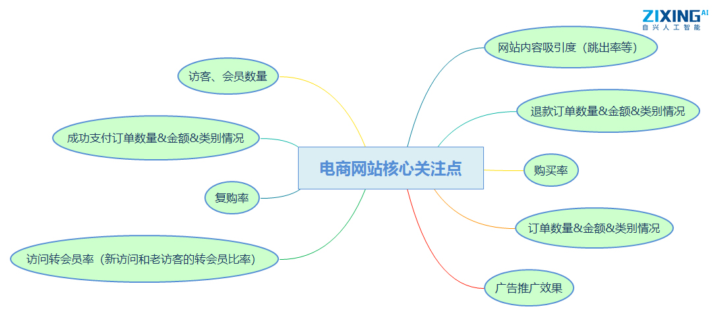
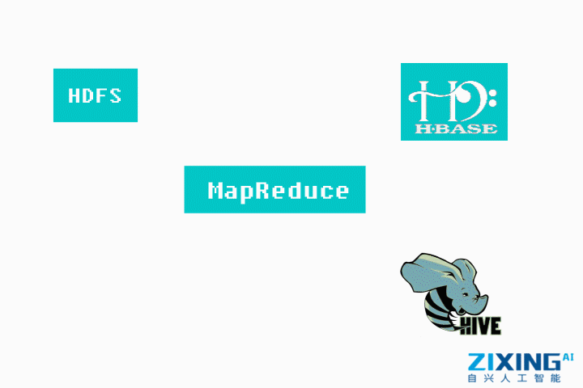
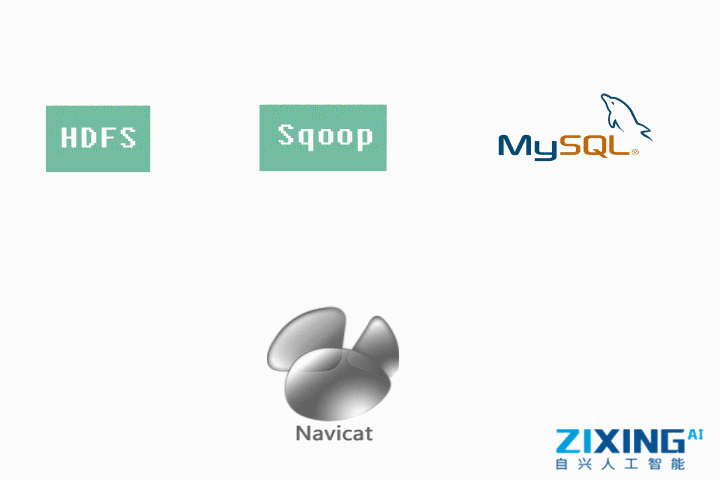

## 2.2项目需求

### 2.2.1电商网站需求

电商网站核心关注点：购买率，复购率，订单数量&金额&类别情况，成功支付订单数量&金额&类别情况，退款订单数量&金额&类别情况，访客、会员数量，访问转会员率（新访问和老访客的转会员比率），广告推广效果，网站内容吸引度（跳出率等）。

电商网站需求分析：电商网站上线后，通过收集用户行为数据，进行多维度统计分析，掌握网站线上运营情况，供运营部门分析业务展开情况，进行优化网站、调整广告投入，进行更好的促销、精准营销等活动。

### 2.2.2项目具体需求

捕获用户每天的行为数据，生成业务日志文件，根据日志文件清洗、分析、提取出需要的价值信息(pv:页面浏览量，衡量网站的用户访问的网页数量；用户每打开一个页面就记录一次，多次打开同个一个页面则浏览量累计。描述用户访问网站信息，应用于基本的各个不同计算任务。uv:独立独立访客数，1天内访问某站点的人数（以cookie为依据），1天内同一访客的多次访问只计为1各访客。S_time：会话时长等)，对网站的良好运营提供有价值的指标。

具体功能点设计：

1.  捕获(JsSDK) 用户行为数据(launch 事件、pageView事件、event事件、chargerequet事件)。

2.  将捕获的数据发送给web服务器，生成日志文件(Nginx)。

3.  将日志文件上传至文件存储系统中(Shell 脚本、Flume)。

    

4.  在文件存储系统中对日志文件进行清洗，过滤掉脏数据和不需要的字段(MapReuce job任务)。

5.  将过滤后的日志文件导入到数据库中(HBase)。

6.  通过MapReduce程序或Hive进行统计分析(Hive)。

    

7.  将统计分析后的结果通过sqoop导入到本地数据库中进行永久储存( Mysql)。

8.  最后通过Navicat将数据库里面的文件展示出来。

    

9.  数据可视化：在前端进行展示(SpringMVC + Highcharts)。
